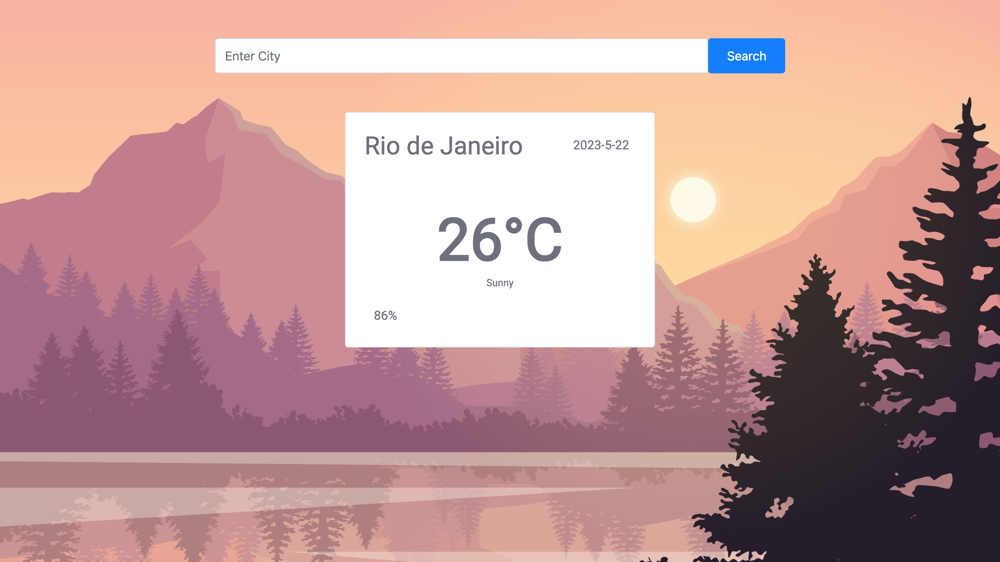

# weather-app

WEATHER APP

Projeto criado usando API do open-weather. Esse app foi feito com HTML, CSS, Bootstrap e JavaScript.

Adicione a sua cidade no campo de busca e aperte o ícone. Você verá a temperatura da sua cidade, descrição do céu, humidade e data.

Se você errar o nome da cidade, receberá um alerta.

